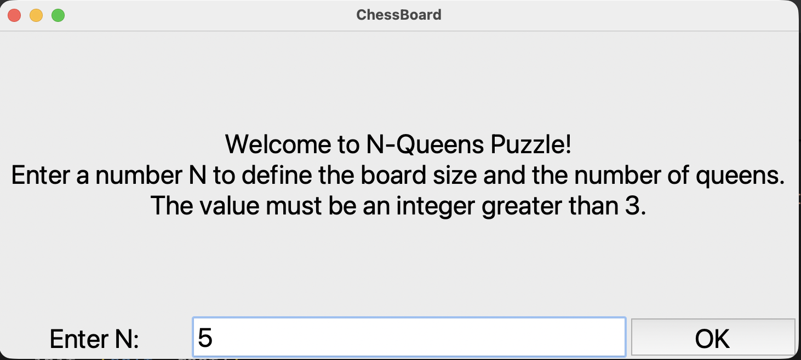

# N-Queens Puzzle Solver & Visualizer

An interactive Python application that solves the classic **N-Queens problem** using a recursive backtracking algorithm and visualizes the solution on a dynamic chessboard.

## Screenshots

  
    
  

## About the Project
The N-Queens puzzle involves placing N chess queens on an NxN chessboard so that no two queens threaten each other (none share the same row, column, or diagonal). 

This project was developed to demonstrate:
- **Algorithmic thinking** (Backtracking, Recursion)
- **Data structures** (Sets for tracking constraints)
- **GUI development** (Tkinter)

## Features
- **Customizable Board Size:** Users can input any N > 3 to generate the corresponding board.
- **Backtracking Visualization:** Solves the problem efficiently using a recursive approach.
- **Dynamic GUI:** A responsive chessboard built with `Tkinter` that adapts to the size of N.
- **Randomized Solutions:** The solver shuffles possible moves to provide a different valid solution on each run.
- **Smart Constraint Tracking:** Uses sets to track forbidden columns and diagonals, ensuring O(1) lookup time.

## How to Run

For the application to work correctly, the **source code (.py)** and the **image files (.gif)** must be located in the **same directory (folder)**.